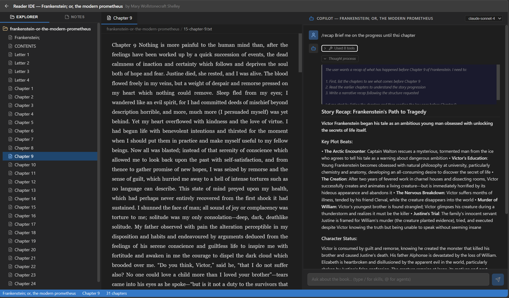

# Reader IDE

A VS Code-like reading experience for EPUB books, with an AI reading companion powered by the GitHub Copilot SDK.

Upload EPUB files → read them in a split-panel IDE interface → chat with Copilot about what you're reading.




Reader IDE recreates the feel of a code editor — but for books. Open any EPUB, and its chapters appear as files in a sidebar explorer. Read in a tabbed center panel with breadcrumb navigation, while an AI-powered Copilot chat sits in the right panel, grounded to the book you're reading. Ask it to recap the story so far, explain a passage, trace a theme, or debate a character's choices — using built-in skills (`/recap`, `/explain`, `/theme`) and switchable agent personas (Critic, Philosopher, Historian, and more). It's a reading companion that knows the text.

## Features

- **Library Landing Page** — Upload EPUBs, browse your book collection
- **VS Code-style Reader** — Three-panel layout with resizable panes:
  - **Left**: File explorer (chapters as files in a folder)
  - **Center**: Text viewer with tabs and breadcrumbs
  - **Right**: Copilot chat panel grounded to the current book
- **EPUB Processing** — Adapted from [Karpathy's reader3](https://github.com/karpathy/reader3), extracts chapters as plain text files
- **AI Chat** — GitHub Copilot SDK streams context-aware responses about the book you're reading

## Prerequisites

- **Python 3.10+**
- **Node.js 18+**
- **GitHub Copilot CLI** installed and authenticated (`copilot --version`)
- **Docker** (optional, for containerized deployment)

## Quick Start

### Option A: Docker (recommended)

```bash
# Build the image
docker build -t reader-ide .

# Run the container
docker run -p 8000:8000 reader-ide
```

Open **http://localhost:8000** — the frontend and backend are both served from one container.

> **Note:** The Copilot CLI inside the container needs authentication.
> Pass your GitHub token via environment variable:
> ```bash
> docker run -p 8000:8000 -e GITHUB_TOKEN=<your-token> reader-ide
> ```

### 1. Backend (local)

```bash
cd backend

# Create virtual environment (recommended)
python -m venv .venv
# Windows:
.venv\Scripts\activate
# macOS/Linux:
source .venv/bin/activate

# Install dependencies
pip install -r requirements.txt

# Run the server
python main.py
```

The API server starts at **http://localhost:8000**.

### 2. Frontend

```bash
cd frontend

# Install dependencies
npm install

# Start dev server
npm run dev
```

The React app starts at **http://localhost:5173**.

### 3. Use it

1. Open **http://localhost:5173** in your browser
2. Upload an EPUB file (try [Project Gutenberg](https://www.gutenberg.org/) for free EPUBs)
3. Click the book card to open the reader
4. Browse chapters in the left panel, read in the center, chat with Copilot on the right

## Project Structure

```
reader-ide/
├── backend/
│   ├── main.py              # FastAPI server (routes, CORS, lifecycle)
│   ├── epub_processor.py    # EPUB → chapter .txt files (adapted from reader3.py)
│   ├── copilot_chat.py      # Copilot SDK session manager + SSE streaming
│   ├── requirements.txt     # Python dependencies
│   ├── agents/              # AI agent persona definitions
│   │   ├── archivist.agent.md
│   │   ├── critic.agent.md
│   │   ├── debater.agent.md
│   │   ├── historian.agent.md
│   │   └── philosopher.agent.md
│   └── skills/              # Copilot skill prompts
│       ├── explain.skill.md
│       ├── recap.skill.md
│       ├── summary.skill.md
│       ├── theme.skill.md
│       └── timeline.skill.md
├── frontend/
│   ├── src/
│   │   ├── api.ts           # API client (fetch + SSE streaming)
│   │   ├── types.ts         # TypeScript interfaces
│   │   ├── App.tsx           # Router setup
│   │   ├── pages/
│   │   │   ├── Library.tsx   # Landing page — upload + book grid
│   │   │   └── Reader.tsx    # VS Code layout — 3 panels
│   │   └── components/
│   │       ├── FileTree.tsx  # Explorer sidebar
│   │       ├── TextViewer.tsx # Chapter text display
│   │       ├── NotesPanel.tsx # Notes sidebar panel
│   │       └── CopilotChat.tsx # Chat panel with SSE streaming
│   └── package.json
├── data/                     # Runtime — processed book folders (contents gitignored)
├── Dockerfile                # Multi-stage build (frontend + backend in one image)
├── .dockerignore
└── README.md
```

## API Endpoints

| Method | Endpoint | Description |
|--------|----------|-------------|
| `POST` | `/api/upload` | Upload an EPUB file |
| `GET` | `/api/books` | List all books |
| `GET` | `/api/books/{id}` | Get book metadata |
| `DELETE` | `/api/books/{id}` | Delete a book |
| `GET` | `/api/books/{id}/chapters` | List chapters |
| `GET` | `/api/books/{id}/chapters/{file}` | Read chapter text |
| `POST` | `/api/books/{id}/chat` | Chat (SSE stream) |

## CI/CD — Deploy to Azure

The project includes a GitHub Actions workflow and Bicep infrastructure template for deploying to **Azure Container Apps** via **Azure Container Registry**.

### One-time Azure setup

```bash
# Create a resource group
az group create --name rg-reader-ide --location eastus

# Deploy ACR + Container Apps Environment + Container App
az deployment group create \
  --resource-group rg-reader-ide \
  --template-file infra/main.bicep \
  --parameters appName=reader-ide githubToken=<your-github-token>

# Note the outputs: acrLoginServer, containerAppUrl
```

### Configure GitHub Secrets

Add these secrets to your GitHub repository (**Settings → Secrets → Actions**):

| Secret | Value |
|--------|-------|
| `AZURE_CREDENTIALS` | Output of `az ad sp create-for-rbac --sdk-auth --role Contributor --scopes /subscriptions/<sub-id>/resourceGroups/rg-reader-ide` |
| `ACR_NAME` | ACR resource name, e.g. `readerideacr` (not the full `.azurecr.io` URL) |
| `AZURE_RESOURCE_GROUP` | `rg-reader-ide` |
| `AZURE_CONTAINER_APP_NAME` | `reader-ide-app` |

> The service principal needs **AcrPush** role on the ACR and **Contributor** on the Container App.

### Run the pipeline

Go to **Actions → Deploy to Azure Container Apps → Run workflow**. You can optionally specify a custom image tag; it defaults to the git SHA.

## How the Chat Works

The Copilot chat is grounded to the book you're reading:

1. A **system message** tells the AI it's a reading companion for that specific book
2. The **current chapter text** is injected into the system prompt (up to ~12k chars)
3. The AI only discusses the book — themes, characters, plot, writing style
4. Responses stream back via **Server-Sent Events** for real-time display

## Credits & Inspiration

This project is loosely inspired by Andrej Karpathy's [reader3](https://github.com/karpathy/reader3) — a minimal EPUB reader with an AI reading companion. Reader IDE extends the idea with a VS Code-style multi-panel interface, agents/skills, and streaming chat via the GitHub Copilot SDK.

- **EPUB processing** adapted from [karpathy/reader3](https://github.com/karpathy/reader3)
- **AI chat** powered by [GitHub Copilot SDK](https://github.com/github/copilot-sdk)
- **VS Code theme colors** from [VS Code Dark+ theme](https://github.com/microsoft/vscode)
